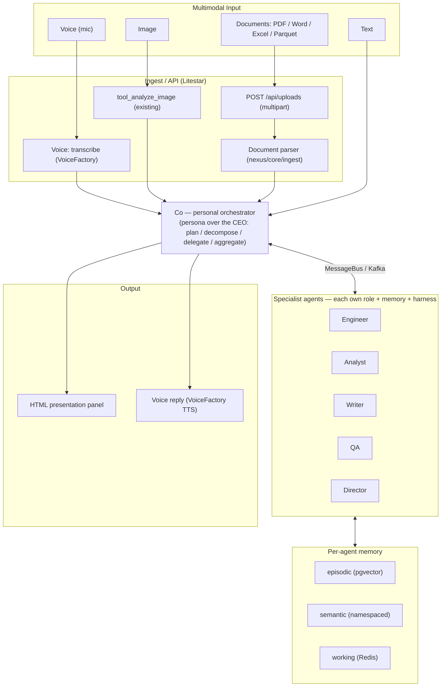
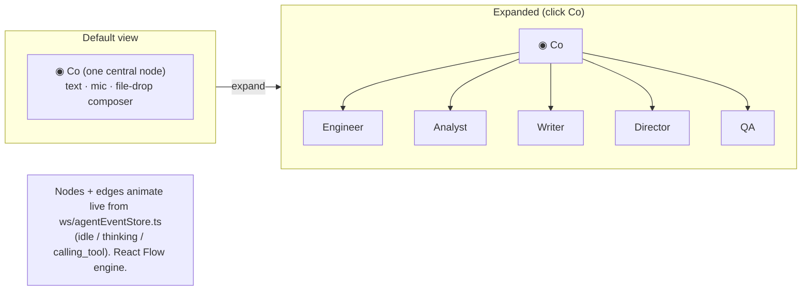
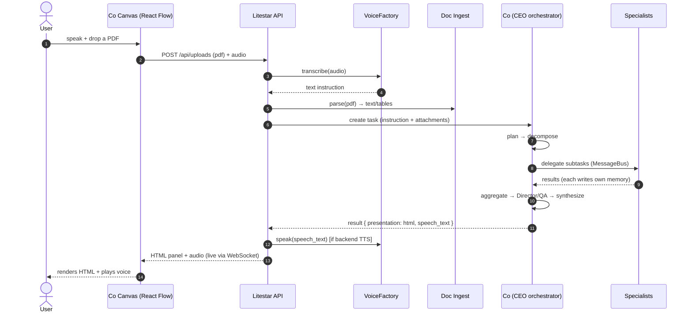
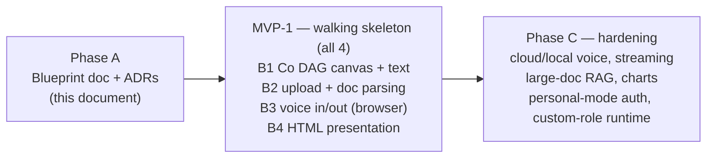

# ASSISTANT.md
## NEXUS → "Co" — Personal Assistant Blueprint

> **Status: PROPOSED blueprint — design only, no source code changed.**
> This document repurposes NEXUS from a generic agentic-company platform into the owner's **personal
> assistant**, fronted by a single orchestrator called **"Co"** (a personal chief-of-staff). It answers
> four asks: (1) multimodal input — **voice, image, documents (PDF/Word/Excel/Parquet)**; (2) **voice
> output + HTML presentation**; (3) a **DAG front-end whose default view is one central "Co" node** that
> expands to reveal and manage the team; (4) **every agent keeps its own role, memory, and harness.**
>
> Companion ADRs: **ADR-087 … ADR-093** in `DECISIONS.md`. Backlog: **BACKLOG-061 … BACKLOG-067**.
> Builds on the accepted 2026-H2 redesign (`REDESIGN.md`: MessageBus seam, staged harness, DBOS/Logfire).

---

## 0. TL;DR — reuse first, add thin

| Ask | Reality | Plan |
|-----|---------|------|
| **#4 each agent: role + memory + harness** | **~80% already built** — per-agent role (`agents` row + prompt + tools), isolated memory (episodic pgvector + semantic + Redis working, keyed by `agent_id`), and outer harness (guard chain + own consumer group). | Keep as-is; wire the orphaned semantic-memory load; align new agents to the Stage-2 `Agent.iter()` harness. |
| **Central "Co"** | **The CEO is already Co** — it plans → decomposes → delegates → aggregates (`agents/ceo.py`). | Add a **Co persona** over the CEO (prompt + UI name). No role/enum churn. |
| **Multimodal input** | Only `tool_analyze_image` exists (PNG/JPG/WEBP/GIF/PDF, Claude+Gemini). No doc parsing, no voice, **no upload endpoint** (task input is text-only). | Add upload endpoint + `core/ingest/` (PDF/Word/Excel/Parquet) + a provider-agnostic `VoiceFactory`. |
| **Voice out + HTML output** | Results are a JSON dict; no HTML, no audio. | Add a typed `presentation` field (sanitized HTML) + `VoiceFactory` TTS. |
| **DAG front-end** | Rich live event store exists (`ws/agentEventStore.ts`), but **no graph engine** — the org chart is flexbox divs. | Add **React Flow** (researched pick) + a modern design-stack upgrade, reusing the event store. |

**Voice = all three backends behind one abstraction** (browser default, cloud, local). **MVP-1 = a thin
end-to-end slice of all four capabilities.**

---

## 1. Target architecture (Co-centric)

## 2. Front-end: single "Co" node → expandable agent DAG

### 2.1 Graph engine — researched, not asserted

At tens–low-hundreds of nodes with **premium custom branded nodes**, DOM/React-node engines win; WebGL
engines only pay off above ~1–2k nodes and can't render custom React/Tailwind nodes.

| Engine | Node model | Fit | Verdict |
|---|---|---|---|
| **React Flow (@xyflow/react)** | React-component nodes (Tailwind + Zustand native — it uses Zustand internally) | Built-in animated edges, pan/zoom, expand/collapse, dagre/elk layout; MIT; best-maintained (shipping 2026) | **Default pick** |
| **tldraw SDK** | React-component shapes | Highest branding ceiling / freeform "wow" canvas; **paid commercial license + you build DAG layout** | Premium alternative |
| **Reaflow** | SVG + React nodes | Built-in ELK auto-layout + Framer-Motion edges; smaller community | Honorable mention |
| WebGL (Sigma / Reagraph / Cosmograph) | GPU/canvas primitives | 10k–1M nodes but no custom React node design | Future escape hatch |

→ **React Flow for MVP.** "Co node expands into a live agent DAG" is a canonical React Flow pattern; keep
**tldraw** in view if a bespoke freeform canvas becomes the priority.

### 2.2 Modern design + optimization stack (stay React, upgrade in place)

A Solid/Svelte/Next reframework costs **4–16 weeks**, degrades AI-assisted coding output, and discards the
live event store — for marginal runtime gains. Instead, upgrade the existing React + Vite stack:

- **React 18 → 19 + React Compiler** — auto-memoization (removes re-render tuning in a WebSocket-churny UI) + Actions. Codemod-assisted, no rewrite.
- **Tailwind 3 → v4** — ~100× faster incremental builds, CSS-first `@theme`; sequence before adopting kits.
- **Motion** (ex-Framer Motion) + **AutoAnimate** — app-wide transitions + live-list animation.
- **shadcn/ui on Base UI** (keep the owned-code model) + **React Aria** for hard-a11y widgets.
- **GSAP** (free since 2025) / **Aceternity · Magic UI** — surgically, for the Co hero flourish only; never the working surfaces.
- **React Three Fiber + drei** — optional, code-split, for a live 3D central "Co" node hero (prototype in Spline).
- Keep **Vite + TanStack Query + Zustand** — already the 2026 best practice for real-time dashboards.

## 3. Request lifecycle (voice + document example)

---

## 4. Backend design

### 4.1 Multimodal input (ADR-089/090)
- **Upload endpoint** `api/uploads.py` — `POST /api/uploads` (multipart; `python-multipart` already
  transitive via `litestar[standard]`). Store bytes via the git-backed `core/workspace/storage.py::write_file`
  (already supports `bytes`) or a local object dir; return an `AttachmentRef`. New **`attachments`** table
  (mime, size, path, parsed-text ref, task/trace link) — Alembic migration 016.
- **Document ingest** `core/ingest/` + tool `tool_read_document` (registered in `tools/adapter.py` +
  `registry.py`): PDF (**pypdf/PyMuPDF**), Word (**python-docx**), Excel (**openpyxl**), CSV/Parquet
  (**pandas + pyarrow**) → normalized markdown + extracted tables. Large files → chunk + summarize via the
  redesign's `ContextAssembler`; fed into task context / working memory.
- **Image:** reuse `tool_analyze_image`; extend registry access to Co.
- Extend `CreateTaskRequest` with `attachments: list[AttachmentRef]`; `AgentBase._load_memory` loads
  attachment text into context.

### 4.2 Voice — provider-agnostic (ADR-088)
- New **`core/voice/` `VoiceFactory`** mirroring `core/llm/factory.py`'s prefix-registry pattern, with
  `STTProvider` + `TTSProvider` protocols. Backends via `VOICE_STT_BACKEND` / `VOICE_TTS_BACKEND`:
  - **browser** (default) — Web Speech API, client-side, zero backend cost.
  - **cloud** — STT: OpenAI Whisper / Deepgram; TTS: ElevenLabs / OpenAI / Google.
  - **local** — STT: faster-whisper; TTS: Piper.
- Endpoints `api/voice.py`: `POST /api/voice/transcribe`, `POST /api/voice/speak` (used only for non-browser backends).

### 4.3 HTML presentation output (ADR-091)
- Extend the task result envelope with a typed `presentation` field:
  `{ format: "html"|"markdown"|"mermaid", content, speech_text }`. Writer/Co produces the HTML artifact;
  **sanitize server-side (nh3/bleach)** before publishing. Surface via `TaskResponse.output.presentation`
  + the WebSocket stream. (Design tools already emit Mermaid/markdown strings to reuse.)

### 4.4 Co persona + personal mode (ADR-087)
- Keep CEO orchestrator internals; add a **Co persona** (reframe the CEO system prompt as a personal
  chief-of-staff, surface the name "Co" in seed + UI). No role/enum change, no migration churn.
- **Personal mode:** reuse the `NEXUS_SEED_DEMO` default workspace/user + a `PERSONAL_MODE` flag that
  auto-scopes every request to the single owner's workspace (removes the multi-tenant JWT friction in
  `api/tasks.py::_require_workspace_id`).

---

## 5. Phased roadmap

- **Phase A (this doc):** blueprint + ADR-087…093 + backlog; CLAUDE.md status + a Personal-Assistant section.
- **MVP-1 (B1–B4):** thin end-to-end slice of all four capabilities against the default single-user
  workspace. Voice starts on the browser backend (zero cost) behind `VoiceFactory` so cloud/local drop in later.
- **Phase C:** cloud/local voice providers, streaming TTS, large-document chunking + retrieval, richer
  HTML/charts, simplified personal-mode auth, and the **custom-role runtime** so the user can add their own
  agents that actually run (today `build_agent()` hard-fails on any role outside the 7-value enum).

---

## 6. Reuse / new map

**Reuse:** `frontend/src/ws/agentEventStore.ts`, `frontend/src/components/agents/{LiveStatusBoard,AgentOrgChart,ThinkingStream}.tsx`,
`frontend/src/components/tasks/{SubmitTaskPanel,TaskTraceView}.tsx`, `frontend/src/hooks/{useAgents,useTasks,useTaskTrace}.ts`;
`backend/nexus/agents/{ceo.py,base.py}`, `backend/nexus/memory/*.py`, `backend/nexus/core/workspace/storage.py`,
`backend/nexus/tools/{adapter.py,registry.py}`, `backend/nexus/core/llm/factory.py` (pattern for VoiceFactory),
`backend/nexus/api/tasks.py`, `backend/nexus/db/seed.py`.

**New (build phase):** `frontend/src/components/co/CoCanvas.tsx` (+ node/edge types, `/co` route);
`backend/nexus/api/{uploads.py,voice.py}`, `backend/nexus/core/ingest/`, `backend/nexus/core/voice/`
(VoiceFactory + providers); `backend/alembic/versions/016_attachments.py`; presentation field on the task
result envelope.

## 7. Verification
- **This round (docs):** all Mermaid diagrams validated; ADR numbers sequential from ADR-087; every "reuse"
  path confirmed to exist.
- **Build rounds (later):** MVP-1 acceptance = speak or type a request to Co with a PDF attached → Co
  delegates → specialists run (visible as a live animated DAG) → result renders as an HTML panel and is read
  aloud. Unit tests for the doc parsers, the upload endpoint, the `VoiceFactory` provider selection, and HTML
  sanitization; e2e for the full voice + doc → HTML loop.

---

*Created: 2026-07-12 · Status: PROPOSED (design-only) · Owner: Nexus Project*
*Companion: ADR-087…093, BACKLOG-061…067; builds on REDESIGN.md.*
