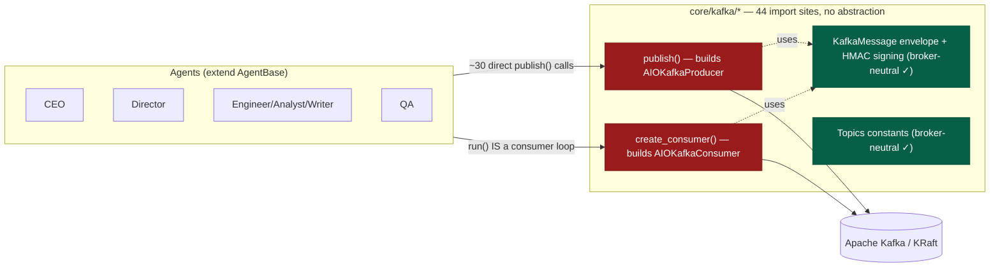
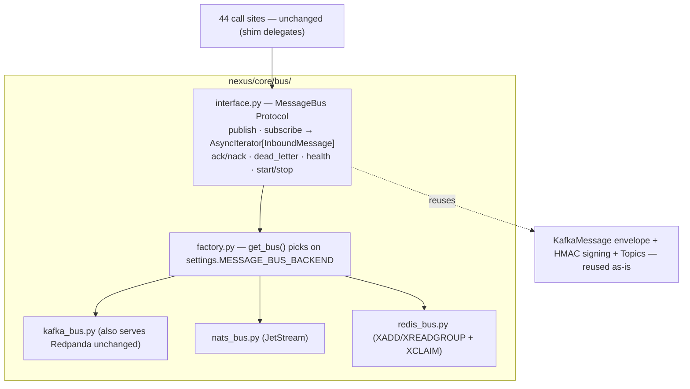
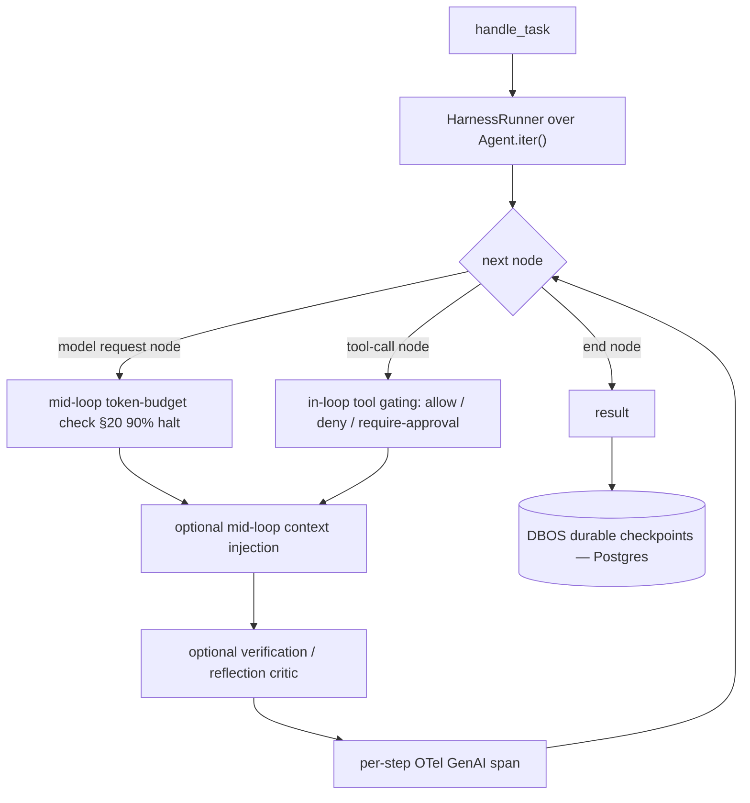
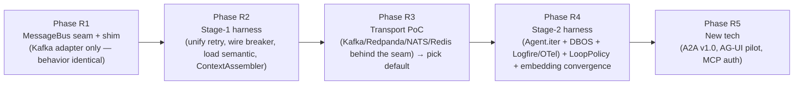

# REDESIGN.md
## NEXUS — Modernization Blueprint (Transport · Harness · Loop · New-Tech Scan)

> **Status: PROPOSED blueprint — design only, no source code changed.**
> This document is the single reference for the 2026-H2 redesign. It answers four questions the
> project owner raised: *(1) modernize the stack, (2) add harness engineering, (3) add loop
> engineering, (4) re-evaluate whether Kafka is the right transport for the whole system — backed
> by an unbiased, reality-based comparison and a proof-of-concept, not an asserted opinion.*
>
> Companion ADRs: **ADR-077 … ADR-086** in `DECISIONS.md`. Staged implementation items:
> **BACKLOG-053 … BACKLOG-060**. On acceptance, the relevant CLAUDE.md sections are updated and
> each ADR flips `proposed → accepted`.

---

## 0. TL;DR

| Ask | Verdict |
|-----|---------|
| **Modernize** | Reconcile the stale `pydantic-ai` pin (ADR-014 says 0.5; code is on 1.56), reclaim dormant machinery (`core/retry.py`, circuit breaker, semantic memory), tidy infra (dup k8s overlays). |
| **Harness engineering** | Staged. Stage 1 formalizes the existing guard chain + wires the dormant pieces. Stage 2 replaces the black-box `pydantic_ai.Agent.run()` with an instrumented `Agent.iter()` loop. Zero new orchestrator. |
| **Loop engineering** | Make the four loop levels explicit under one `LoopPolicy` model; move meeting convergence from lexical Jaccard to embedding cosine. |
| **Kafka: keep or replace?** | Kafka **works** but is over-provisioned, and the real defect is that the system is **hard-welded** to it (44 import sites; the agent run loop *is* an `aiokafka` loop). Fix the coupling first with a `MessageBus` seam, then let a PoC pick the default from **Kafka / Redpanda / NATS+JetStream / Redis Streams.** |
| **New tech** | Adopt/pilot now: **A2A v1.0** upgrade, **AG-UI** for the dashboard, **DBOS + Logfire/OTel** for durable+observable loops, **MCP auth** modernization. Watch: agentgateway, payments (AP2/x402/Stripe-ACP), ANP. Drop: ACP (merged into A2A). |

Nothing here rips out Kafka. The redesign is **decoupling + instrumentation**, so every step is
incremental and reversible.

---

## 1. Current-state assessment (what the code actually is)

NEXUS is **real, production-grade code** — ~190 Python files, Alembic migrations 001–015, and real
unit/integration/behavior/chaos/e2e suites. Not scaffolding. Three structural facts drive this redesign:

1. **The transport is hard-welded.** `nexus.core.kafka.*` is imported in **44 files** with ~30
   `publish()` calls, and `AgentBase.run()` *is* an `aiokafka` consumer loop (`agents/base.py`). Only
   the message envelope (`core/kafka/schemas.py::KafkaMessage`) and topic constants
   (`core/kafka/topics.py::Topics`) are broker-agnostic. `producer.py` / `consumer.py` construct
   `aiokafka` objects directly and leak the `ConsumerRecord` shape (`msg.value`, `msg.topic`) into
   callers (`base.py:184-198`, `result_consumer.py`). There is **no `MessageBus` interface**.
2. **There is no NEXUS-owned inference loop.** The LLM+tool iteration is a black box inside
   `pydantic_ai.Agent.run()`. The "max 20 tool calls" rule is enforced by monkey-wrapping each tool
   with a shared counter in `agents/factory.py:36`, not by any loop NEXUS controls. All "loop"
   behavior today is *orchestration-level* (Kafka cycles, meeting rounds, QA rework).
3. **Substantial machinery is built but dormant.** `core/retry.py` is unused — every agent
   copy-pastes its own `_run_with_retry` (6 near-identical copies in engineer/ceo/qa/director/analyst/
   writer). The circuit breaker (`core/llm/circuit_breaker.py`) never sees live traffic
   (`provider_health.record_call()` is only called from the analytics endpoint). `memory/semantic.py`
   is never loaded into agent context. Meeting convergence uses lexical **Jaccard** similarity with an
   explicit `TODO` to move to embeddings (`core/kafka/meeting.py`).

Plus modernization debt: **ADR-014** pins `pydantic-ai 0.5.x` but `pyproject.toml` is on `1.56`
(stale ADR); frontend is React 18; k8s has duplicate `prod`/`production` overlays.

### Current architecture (transport-centric view)

The green boxes already travel; the red boxes are the coupling to remove.

---

## 2. Pillar A — Transport: is Kafka right? (unbiased comparison + PoC)

### 2.1 Reframing the question

The NEXUS workload is **agent choreography**, not analytics streaming: work-queue dispatch
(CEO→specialist, competing consumers), request/reply (CEO delegates and waits), pub/sub fan-out to the
dashboard (already offloaded to Redis pub/sub, §11 db:2), and multi-round "meeting" polling. Throughput
is low-to-moderate; **the dominant cost is LLM latency and token spend, not broker throughput.** Every
task blocks on multi-second model calls. Therefore **broker throughput benchmarks measure the axis
NEXUS does not care about.** The decision axes that matter: latency floor, delivery correctness, replay,
operational weight, and async-Python ergonomics.

**Direct answer:** Kafka *works* (KRaft is stable, tests pass) but it is over-provisioned for the
current single-user reality — you pay JVM operational weight and a batching latency floor for
throughput headroom you will never approach. Its durability/replay *is* genuinely wanted for the
multi-tenant audit vision. The real problem is not Kafka; it is that **the system cannot change
transport without touching 44 files.** So: **abstract first, then choose via PoC.**

### 2.2 The `MessageBus` seam (ADR-077)

Introduce `nexus/core/bus/`:

Design rules:
- **`InboundMessage` normalizes** `{topic, value, key, headers, id}` so no adapter's native record shape
  (aiokafka `ConsumerRecord`, NATS `Msg`, Redis stream entry) leaks into `base.py` / `result_consumer.py`.
- **Reuse, don't replace:** `Topics` (become "subjects"; NATS wildcards like `agent.commands.*` map to
  role routing), the `KafkaMessage` envelope, and HMAC `signing.py` are already broker-neutral and carry
  over unchanged.
- **Backward-compatible shim (the key that makes this incremental):** re-point the existing
  `producer.publish` / `consumer.create_consumer` free functions to delegate to `get_bus()`. The 44 call
  sites keep working; only the two seam functions and the consume-loop shape change.
- **Lift cross-cutting concerns into the bus:** idempotency (`check_idempotency`, Redis `SET NX`) and
  dead-letter routing move into the bus layer so every adapter inherits them once.

### 2.3 Four-way comparison (evidence-based)

Numbers are directional — third-party and vendor benchmarks disagree by 3–4× depending on `acks`,
partitions, message size, and batching. Vendor sources are flagged; the PoC (§2.5) is the tie-breaker.

| Axis | **Kafka (baseline)** | **Redpanda** | **NATS + JetStream** | **Redis Streams** |
|---|---|---|---|---|
| p99 latency, moderate load | ~tens of ms (batch/segment floor) | low, predictable (no JVM GC) | **~1–5 ms (lowest)** | very low (in-mem) |
| Peak throughput | **highest** (500K–1M+/s) | ≈Kafka, workload-dependent | 200–820K/s (ample) | high, RAM-bound |
| Durability / replay | **best** (replicated log, ∞ retention) | Kafka-equivalent | good (JetStream log + replay) | weak (optional persist, no partition replication) |
| Delivery semantics | ALO; EOS via txns | same as Kafka | ALO; EOS via dedup+ack | ALO (manual ack) |
| Consumer groups | native, auto-rebalance | same | queue groups + durable consumers | yes, manual rebalance |
| Dead-letter | DIY topic | DIY topic | MaxDeliver + advisories | DIY via XPENDING/XAUTOCLAIM |
| Request/reply fit | poor (fake w/ corr-IDs, ~4 ops) | poor | **native primitive (best)** | DIY |
| Ops weight | **heaviest** (JVM, large RAM) | light (single C++ binary) | **lightest** (~25 MB Go binary) | **zero new** (already in stack) |
| JVM? | yes | no | no | no |
| Python async client | `aiokafka` (mature) | `aiokafka` (identical) | `nats.py` (async-native) | `redis-py` async (very mature) |
| NEXUS pattern coverage in one system | log + queues; weak req/reply | same | **all four patterns natively** | pub/sub + queue; weak durability |
| Code change to adopt | — | **near-zero (wire-compatible)** | transport rewrite behind the seam | moderate |

*ALO = at-least-once; EOS = exactly-once.* **Apache Pulsar was evaluated and ruled out** for NEXUS:
its Python client wraps the C++ library, the `pulsar.asyncio` surface lacks async subscribe/ack, and a
supplied logger can make unrelated `async` functions return `None` — disqualifying for an async-native,
type-strict codebase. RabbitMQ (quorum + streams) is a reasonable middle (best native DLQ, solid RPC)
but does not decisively beat NATS on any axis NEXUS cares about, so it is not in the PoC shortlist.

### 2.4 Recommendation posture

- **Transport becomes a deployment flag** (`MESSAGE_BUS_BACKEND`), not an architectural commitment.
- **Redpanda** is the lowest-risk lighter option — `aiokafka`, topics, DLQ, consumer groups, and replay
  are all unchanged (Kafka wire protocol), you just drop the JVM/ZK weight. Highest ROI if the team is
  happy with Kafka semantics and only wants it lighter.
- **NATS + JetStream** is the best *architectural* fit — the only candidate that natively covers all four
  NEXUS patterns (incl. request/reply) in one small binary, letting you collapse "Kafka + Redis pub/sub"
  into one system and delete correlation-ID plumbing. Cost: a transport rewrite (contained by the seam)
  and a less-proven long-retention audit substrate.
- **Redis Streams** is the cheapest "do nothing new" option for the current solo phase (Postgres is the
  real source of truth per §3, Redis already handles dashboard pub/sub), but a poor terminal choice for
  the durable multi-tenant vision.
- **Do not pre-commit.** The seam makes all four swappable; the PoC decides the default.

### 2.5 Proof-of-Concept spec (design-only — to run in a later phase)

A throughput benchmark is the *wrong* test. Replay a **realistic agent trace** across all four candidates
behind the same `MessageBus` interface, and report **distributions, not averages**:

1. **Request/reply round-trip** (CEO→specialist→CEO), p50/p99, at NEXUS concurrency (tens), including the
   correlation-ID plumbing cost Kafka/Redis need and NATS does not. *This is the number that moves task wall-clock.*
2. **Meeting-room pattern cost** — create/tear-down of many short-lived topics/subjects per task + N-round
   fan-in latency. (Kafka topic churn is expensive; NATS subjects and Redis streams are cheap — measure it.)
3. **Durable replay correctness** — kill the broker mid-task, restart, assert the audit trail replays
   completely and in order (ties to §3.9 crash recovery). Measure replay throughput for a day's audit log.
4. **Delivery under chaos** — duplicate-delivery rate and DLQ behavior when a consumer crashes mid-process
   (validates §14 chaos scenarios: idempotency key + dead-letter). Measure app-level glue each broker needs.
5. **Operational footprint** — broker RAM/CPU at idle and under the *same* load (a real per-tenant hosting cost).
6. **Python-async ergonomics (decisive, qualitative)** — lines of glue to implement all four patterns + DLQ
   + idempotency per client; whether it is truly async-native or a sync wrapper.

**Controls:** identical hardware, `acks`/durability level, small-JSON message sizes (agent envelopes are
tiny), and subject/partition count. Run long enough (>12h) to catch the sustained-load degradation
independent testers observed in Redpanda. **Decision rule:** pick the lightest backend that passes (3) and
(4) at the concurrency NEXUS actually runs; only escalate to Kafka/Redpanda if the audit-replay SLA
demands it.

---

## 3. Pillar B — Newer tech scan (protocols + tooling)

Layers must stay distinct: **MCP** = agent→tools; **A2A/ACP/ANP** = agent↔agent; **AG-UI** = agent↔UI;
**AP2/x402/Stripe-ACP** = agent↔payments; **agentgateway** = infra/mediation. Conflating them is the
classic integration mistake NEXUS's own §1 already warns about.

### 3.1 Protocols

| Protocol | Layer | Governance | Maturity (mid-2026) | NEXUS action |
|---|---|---|---|---|
| **MCP** | agent→tools | Anthropic → community steering group | high; spec 2025-11-25, RC 2026-07-28 | **Upgrade auth** (OAuth/OIDC, mandatory PKCE, CIMD URL-based client registration) — ADR-085 |
| **A2A** | agent↔agent | **Linux Foundation** | **v1.0 (Apr 2026)**; 150+ orgs, 5 SDKs | **Upgrade** from the April-2025 pre-1.0 spec + adopt official SDK — ADR-083 |
| **AG-UI** | agent↔UI | CopilotKit (OSS) | growing fast; **Pydantic AI native** | **Pilot** on the dashboard — replaces bespoke Kafka→Redis→WebSocket plumbing — ADR-084 |
| **ACP (IBM)** | agent↔agent | LF — **merged into A2A** | subsumed | **Drop** — covered by A2A |
| **ANP** | agent↔agent (P2P/DID) | OSS + W3C Community Group | research-grade; ~2027 horizon | **Keep deferred** — current stance correct |
| **AP2 / x402 / Stripe-ACP** | agent↔payments | Google / LF / Stripe+OpenAI | live but **3-way race, no winner** | **Watch** — only if a commerce task category appears |
| **agentgateway** | infra/mediation | **Linux Foundation** (Solo.io) | production | **Watch / buy-vs-build** for the multi-tenant edge |

### 3.2 Tooling (harness / durability / observability)

| Tool | Role | Composes with Kafka + Pydantic AI? | NEXUS action |
|---|---|---|---|
| **`Agent.iter()` / `AgentRun.next()`** (Pydantic AI v1) | own the inference loop | Yes — zero new infra, `pydantic-graph` is internal plumbing, not an orchestrator | **Adopt** (Stage-2 harness) |
| **DBOS** | durable intra-task loops (Postgres-backed library) | Yes — pure library, adds no event router; reuses existing Postgres | **Adopt** for durability — ADR-081 |
| **Temporal** | durable long workflows | Only if scoped to >1hr workflows; tends to want to *be* the orchestrator | **Keep scoped** (as `integrations/temporal/` already intends) |
| **Logfire + OTel GenAI semconv** | per-step tracing | Yes — OTel-native, one-line Pydantic AI instrumentation | **Adopt** — ADR-082 |
| **Langfuse / Arize Phoenix** | self-host traces + evals | Yes (OTel ingestion) — maps to `prompts`/`prompt_benchmarks` | **Optional** self-host add-on |
| **LangGraph / CrewAI / AutoGen / OpenAI Agents SDK / Google ADK** | agent runtimes | **No** — each is a second orchestrator and/or a Pydantic-AI replacement | **Reject as runtimes** (mine for patterns only) |
| **Restate / Inngest** | durable execution + event router | **No** — duplicate NEXUS's Kafka consumers/idempotency/guard chain (Restate) or bring a competing router, TS-first (Inngest) | **Reject** |

**Conceptual spine:** Anthropic's *Building Effective Agents*, *Effective Context Engineering*, and
*Effective Harnesses for Long-Running Agents*, plus the evaluator-optimizer pattern — which validates
NEXUS's separate Director/QA verification (verification needs fresh context, not the generator's own).

---

## 4. Pillar C — Harness engineering (staged)

**Harness** = the instrumented scaffolding around each LLM invocation.

### Stage 1 — moderate (formalize + wire the dormant pieces)
- **Name the outer harness contract:** document the existing guard chain
  (`base.py::_execute_guarded_body`, ~line 330) as canonical: idempotency → budget → context → `handle_task`
  → write-memory → publish → broadcast → clear.
- **Unify retry:** replace the 6 copy-pasted `_run_with_retry` with `core/retry.py::retry_async` +
  `RetryPolicy.LLM` (backoff + jitter + typed retryable/non-retryable).
- **Wire the circuit breaker:** wrap every real LLM call with `provider_health.record_call()` via a shared
  `AgentBase._invoke_llm` helper, so `circuit_breaker.py` trips on live failures instead of only powering a
  dashboard read.
- **Load semantic memory** into `_load_memory` (today only episodic + working + workspace are loaded).
- **General `ContextAssembler`:** promote the workspace token-budgeted packer
  (`core/workspace/service.py::load_context_for_task`, ~line 457) into a reusable assembler used by all
  agents — the "smallest high-signal token set" context-engineering principle.

### Stage 2 — deep (own the inference loop)

- Replace the black-box `pydantic_ai.Agent.run()` with an `Agent.iter()` / `AgentRun.next()` loop inside a
  NEXUS `HarnessRunner`. Today's side-effects become first-class per-step invariants: mid-loop token budget,
  real in-loop tool gating (retiring the `factory.py:36` monkey-counter), mid-loop context injection,
  optional verification, and per-step OTel spans.
- **DBOS** wraps the run for durable, crash-consistent intra-task loops — a Postgres-backed library, no new
  cluster, no competing event router. **Temporal stays scoped to >1hr workflows only.**
- **Logfire + OTel GenAI conventions** instrument the loop; convention-compliant spans let Langfuse/Phoenix
  self-host storage + evals be added later without rework.

---

## 5. Pillar D — Loop engineering

Make the four loop levels explicit instead of ad-hoc:

| # | Loop | Where | Bound today | Redesign |
|---|------|-------|-------------|----------|
| 1 | **Inference loop** (one agent) | inside `Agent.run()` (black box) | `MAX_TOOL_CALLS=20` via monkey-counter | Stage-2 harness owns it under a `LoopPolicy` |
| 2 | **Task/guard loop** (per bus message) | `base.py::run()` | guard chain | formalized outer harness |
| 3 | **Verification/rework loop** | `qa.py` rework + `director.py` synthesis gate | `qa_max_rework_rounds` (bounded — cleanest existing loop) | keep; carry previous feedback; ground in evaluator-optimizer |
| 4 | **Convergence loop** (multi-agent) | `core/kafka/meeting.py` | max-rounds + lexical Jaccard | embedding cosine convergence/stagnation/oscillation |

- **Unified `LoopPolicy` model** — every loop declares `max_iterations`, `token_budget`, `timeout`, and a
  `termination_predicate`. Replaces the scattered `MAX_TOOL_CALLS`, `qa_max_rework_rounds`, and meeting
  max-rounds constants.
- **Embedding-based convergence** — replace `meeting.py`'s Jaccard (its own `TODO`) with cosine similarity
  via existing `memory/embeddings.py`. Document convergence / stagnation / oscillation thresholds.
- **Loop-guard catalog** — convergence, stagnation, oscillation, forced-termination → human escalation;
  cross-reference the §23 unbounded-loop *cost* risk (this is a spend-safety control, not just quality).

---

## 6. Pillar E — Modernization

- **ADR-086** supersedes stale **ADR-014**: record actual Pydantic AI 1.x usage; `Agent.iter()` availability
  is what unlocks the Stage-2 harness.
- Dependency-refresh pass: revisit pre-1.0 pins (`aiokafka`, `taskiq`) and the `anthropic` ceiling pin.
- Reclaim dead code (`retry.py`, circuit breaker, semantic memory) — folded into Pillars C/D.
- Infra: dedupe k8s `prod`/`production` overlays; add Redpanda/NATS/Redis-Streams docker-compose profiles
  behind `MESSAGE_BUS_BACKEND`.
- Frontend: React 18 → 19 as a low-priority item, paired with the AG-UI pilot.

---

## 7. Rollout (non-breaking, staged)

R1 is pure decoupling with the Kafka adapter — zero behavior change, fully reversible — which is the gate
that de-risks everything after it.

## 8. Risks & mitigations

- **Seam misses a Kafka-specific behavior** (offset commit timing, partition keys, rebalance) → the
  `MessageBus` Protocol must be validated against every current pattern (§ verification below); R1 ships
  Kafka-only so any regression is isolated from the transport choice.
- **`Agent.iter()` churn across Pydantic AI minors** → pin and cover the harness with behavior tests;
  Stage-2 is gated behind Stage-1, so the wins land even if Stage-2 slips.
- **DBOS adds a Postgres write per step** → acceptable (Postgres already the source of truth); measure in R4.
- **New-tech scope creep** → A2A/AG-UI/MCP are pilots behind flags; payments/ANP stay on the watch-list.

## 9. Sources

Transport: onidel 2025 broker benchmarks · ComputingForGeeks Kafka-vs-Redpanda (independent) · vitalvas &
semicolony NATS-vs-Kafka · JusDB & Instaclustr Redis-Streams-vs-Kafka · NATS JetStream docs · RabbitMQ
quorum/streams docs · Confluent Kafka-vs-Pulsar (vendor, flagged) · apache/pulsar-client-python issue #11823.
Protocols: modelcontextprotocol.io spec 2025-11-25 + auth deep-dives (Parecki, Delimarsky) · Linux
Foundation A2A launch + 1-year recap · LF-AI ACP-joins-A2A · agent-network-protocol.com + W3C CG ·
Google Cloud AP2 · Coinbase x402→LF · CopilotKit AG-UI docs + TechCrunch funding · Solo.io/LF agentgateway.
Harness/loop: ai.pydantic.dev (Agents, durable execution, run API) · DBOS docs (Pydantic AI integration) ·
Kai Waehner "durable execution engine in an EDA" · Restate+Kafka · pydantic.dev Logfire · OTel GenAI
semconv · Anthropic *Building Effective Agents* / *Effective Context Engineering* / *Effective Harnesses*.

*Full source URLs and vendor-bias annotations are retained in the redesign research appendix (PR description).*

---

*Created: 2026-07-10 · Status: PROPOSED (design-only) · Owner: Nexus Project*
*Companion: ADR-077…086, BACKLOG-053…060*
